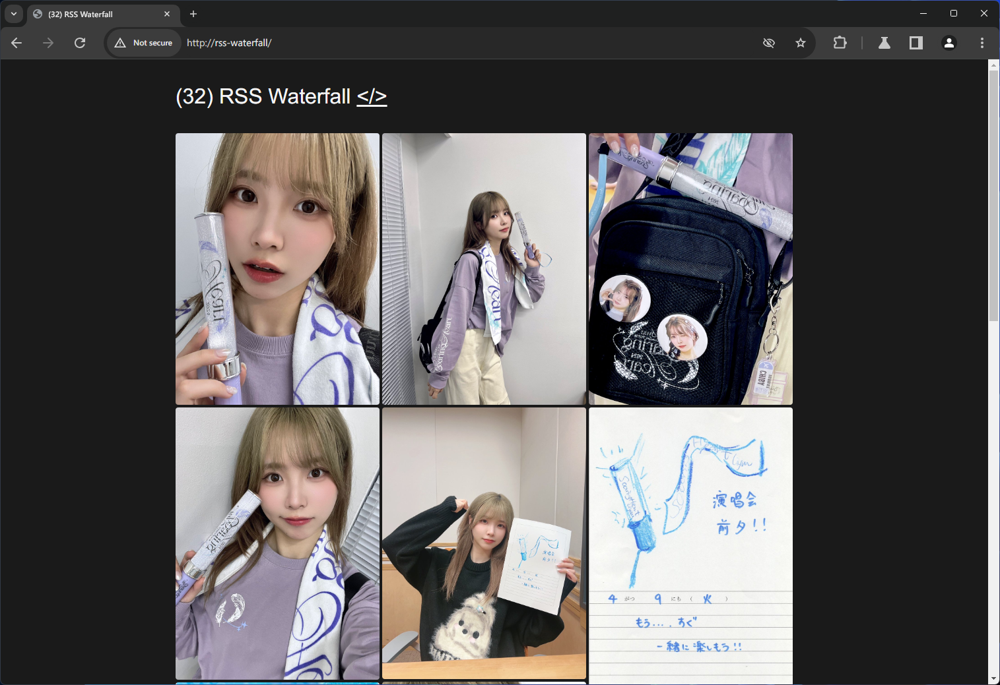

# Galerie
A Pinterest/Xiaohongshu photo wall style RSS reader

[](https://github.com/sekai-soft/galerie/blob/master/README.zh.md)
[](https://github.com/sekai-soft/galerie/pkgs/container/galerie)
[](https://github.com/sekai-soft/galerie/pkgs/container/galerie)



## Features
* Supports self-hosted [Miniflux](https://miniflux.app)
* View unread images from RSS feeds in a beautiful photo wall
* 🚧 Mark images as read as you scroll
* 🚧 Quickly share images to Mastodon
* Quickly add images to Pocket

## Hosted instance
Visit [galerie-reader.app](https://galerie-reader.app) and login with your Miniflux instance

## Run your own server
The Docker image is `ghcr.io/sekai-soft/galerie:latest` and it's available in both x86-64 and arm64

The Docker image is able to take no environment variable. If Miniflux authentication related environment variable is present, it will require you to login with your Miniflux instance on web UI (just like the hosted instance).

Here is a table of environment variables that the container takes
| Name                  | Required | Comment                                                                                                                                       |
| --------------------- | -------- | --------------------------------------------------------------------------------------------------------------------------------------------- |
| `MINIFLUX_ENDPOINT`   | No       | URL endpoint for your Miniflux API. `MINIFLUX_USERNAME` and `MINIFLUX_PASSWORD` has to be present.                                            |
| `MINIFLUX_USERNAME`   | No       | Username for your Miniflux API                                                                                                                |
| `MINIFLUX_PASSWORD`   | No       | Password for your Miniflux API                                                                                                                |
| `POCKET_CONSUMER_KEY` | No       | For connecting to Pocket optionally. See ["Connect to Pocket" section](#connect-to-pocket)                                                    |
| `PORT`                | No       | The port that the server binds to. Defaults to `5000`.                                                                                        |
| `BASE_URL`            | No       | Internet facing URL that the server will be exposed at. Required if connecting to Pocket or Mastodon, or a secure context is needed.          |
| `DEBUG`               | No       | Set `1` to enable debug mode. Exception will be thrown in process instead of displayed on an error page. Defaults to empty string (disabled). |

Here is an example `docker-compose.yml` file
```yml
services:
    galerie:
        image: ghcr.io/sekai-soft/galerie:latest
        ports:
            - "5000:5000"
        environment:
            - MINIFLUX_ENDPOINT=http://miniflux
            - MINIFLUX_USERNAME=miniflux
            - MINIFLUX_PASSWORD=test123
            - POCKET_CONSUMER_KEY=
        restart: unless-stopped
```

### Connect to Pocket
There are three ways you are able to connect to Pocket

* On the hosted instance, a Pocket application is already available, so you can just log in with your Pocket account
* On your self-hosted instance, you can create your own Pocket developer application and authorize yourself via OAuth
    1. Create a new Pocket developer application [here](https://getpocket.com/developer/apps/new)
        * Make sure that it has "Add" permission at least
    2. Go to [My Apps](https://getpocket.com/developer/apps/) and click the developer application you just created
    3. Copy the Consumer Key. This will be your `POCKET_CONSUMER_KEY`.
    4. Authorize yourself via OAuth on the settings page

## Development
* Run server: `flask run --reload`
* Run tests: `pytest -vv`
* Translate strings
    1. Put raw English strings in code using `_(...)` and `_l(...)`
    1. Run `flask translate update`
        * See `babel.cfg` for what files are scanned
    1. Edit updated `po` files
    1. Run `flask translate compile` and restart server
