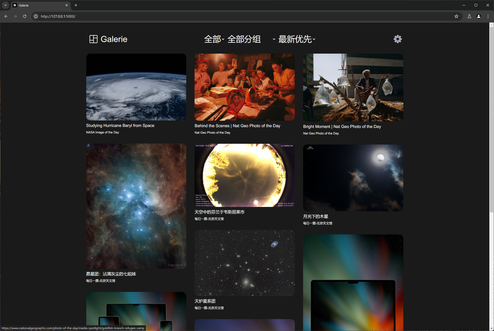

# Galerie
一款 Pinterest/小红书照片墙式的 RSS 阅读器

[](https://github.com/sekai-soft/galerie/pkgs/container/galerie)
[](https://github.com/sekai-soft/galerie/pkgs/container/galerie)



## 功能
* 支持自托管的 [Miniflux](https://miniflux.app)
* 以照片墙的形式从 RSS 源中浏览未读图片

## 托管实例
访问 [galerie-reader.app](https://galerie-reader.app) 并登陆您的 Miniflux 实例

## 自己运行服务器
Docker 镜像是 `ghcr.io/sekai-soft/galerie:latest`，并且 x86-64 和 arm64 都可用

Docker 镜像可以不接受任何环境变量。如果没有提供任何与 Miniflux 认证相关的环境变量，您需要在网页上使用您的 Miniflux 实例登录（就像托管实例一样）。

以下是容器接受的环境变量表
| 名称                | 是否必需 | 备注                                                                                 |
| ------------------- | -------- | ------------------------------------------------------------------------------------ |
| `MINIFLUX_ENDPOINT` | 否       | 您的 Miniflux API 的 URL 端点。必须提供 `MINIFLUX_USERNAME` 和 `MINIFLUX_PASSWORD`。 |
| `MINIFLUX_USERNAME` | 否       | 您的 Miniflux API 用户名                                                             |
| `MINIFLUX_PASSWORD` | 否       | 您的 Miniflux API 密码                                                               |
| `PORT`              | 否       | 服务器绑定的端口。默认为 `5000`。                                                    |

以下是 `docker-compose.yml` 文件示例
```yml
services:
    galerie:
        image: ghcr.io/sekai-soft/galerie:latest
        ports:
            - "5000:5000"
        environment:
            - MINIFLUX_ENDPOINT=http://miniflux
            - MINIFLUX_USERNAME=miniflux
            - MINIFLUX_PASSWORD=test123
        restart: unless-stopped
```
